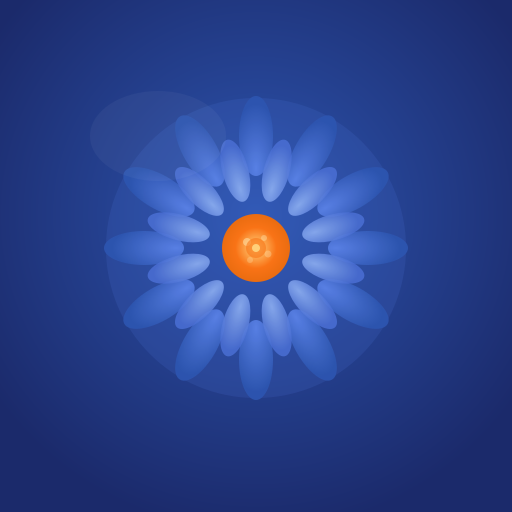

  
  <h1>🏭 Контент-фабрика «Янка Купала»</h1>
  
<b>Мощная AI-машина для написания авторских психологических лонгридов и постов.</b> 
  Сканирует мировой рынок прессы, спасает от таймаутов, сама избегает вымышленных кейсов и выдерживает корпоративный лимит по символам.

  

    
    
    
    
    
  

 

## 🌟 Возможности проекта

*   **Self-Healing AI Infrastructure**
    Сервер работает на лимитах Vercel. Хэш-балансировщик аккуратно разбрасывает нагрузку (Load Balancing) на топовые флагманы *gpt-5.5, gemini-3.5-flash, o3* (генерация). При ошибках `429 Insufficient Quota` включается жесткий cooldown 24ч и запрос подхватывает безотказный хвост `llama-4` и `qwen3`. Функция никогда не падает!
*   **Иммерсивный сбор прессы**
    Встроена интеллектуальная машина для чтения научных новостей мира: Англия (BPS Digest), США, Бразилия, Япония и Германия. 
    Использует агрессивные RegEx парсеры — ноль вакансий, редакционной болтовни или реклам. Только "говядина" научной фактуры! Иероглифический блок отключил ИИ галлюцинации Qwen.
*   **Автономность 72-часа**
    Приложение живет без помощи человека благодаря двум Vercel-кронам: не дает базе уходить в `Sleep-mode` (`0 0 */5 * *`) и самостоятельно загружает + переводит ленту ночью (`0 3 */3 * *`). Утром готов свежий русскоязычный рынок трендов.
*   **Без вымышленного опыта (Zero Hallucination Tone)**
    Скрытая директива блокирует проявление синдрома ИИ ("На днях я пила чай с клиентом и поняла..."). Статьи генерируются сухо, мощно и на базе фактуры. Строго до **2500 символов**.

<b>🛠 Конфигурация: Установка и Запуск</b>

 

Вам потребуется ключи от: Google AI Studio, OpenAI, Groq, DeepSeek (Опционально).

1. Скачайте проект 
2. Установите зависимости через `npm install`
3. Подкиньте `.env.local` на основе списка ключей: `GOOGLE_GENERATIVE_AI_API_KEY`, `OPENAI_API_KEY`, `NEXT_PUBLIC_SUPABASE_URL` и тд.
4. Выполните: `npm run dev` 

Для автоматического накатывания DB структур посмотрите каталог `supabase/migrations/`. Мы применяем метод прямого пула SQL (Service Role By-Pass)

## 🧩 Умный Routing & Security
Фреймворк закрыт защитным middleware слоем по паролю (`ACCESS_PASSWORD`). API интерфейсы доступны локально или в фоне для доверенных (Vercel Cron). 

  <i>Developed natively on Web Ecosystem (June 2026 Version). Resilient by design.</i>

